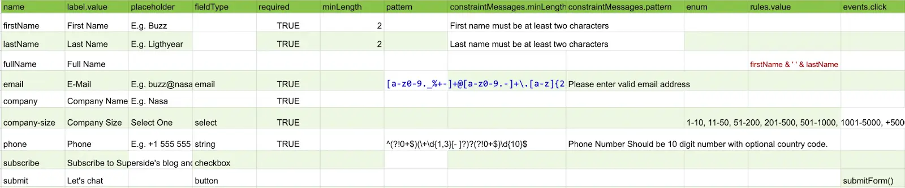
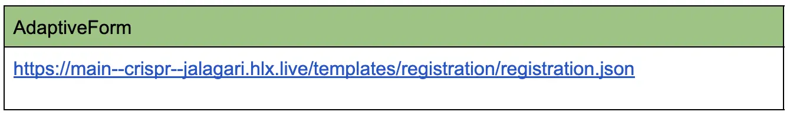

# Adpative Form Block
Adaptive Form Block for Franklin

AEM Form, Headless Adaptive Forms (HAF) specifies a mechanism to create a Form or Data Capture Experience using a JSON representation, which allows rendering that experience across multiple channels.

Adaptive Form Block is Form rendition block which renders the form based on Adaptive Forms Specification (JSON) for Franklin.

## Playground

[Live Playground](https://git.corp.adobe.com/pages/jalagari/adpative-form-block/index.html)

### Local Playground

* Open the project in VSC 
* Install the LiveServer VSC Extension
* Open docs/index.html with LiveServer
* On selecting template
  * Left side view will open the JSON View and
  * On Right side form will be rendered using Adaptive Form Block

## Getting Started -- Franklin

> Adaptive Form authoring is similar to Franklin Form authoring but it expected Excel headers according to Adaptive Form Specification

### Authoring

* Project Creation -- Follow the [Getting started with Franklin - Developer Tutorial](https://www.hlx.live/developer/tutorial)
* Create an Excel workbook or Google sheet anywhere under your Franklin project directory. 
* For this tutorial we will create a sheet in the root of our Franklin project in OneDrive called registration.
* Share the sheet or a parent directory containing the sheet with helixfrm@adobe.com for OneDrive or helix@adobe.com for GDrive.
* Open the workbook and create sheet with name helix-default
* Created header using Adaptive Form specification terminology. 
* You can copy past the table data from [registration template](https://docs.google.com/spreadsheets/d/1_1j-4rZmGFxTmHue15_KnhuskzK_oBhYjR5cskf5Ruc/edit?usp=sharing).

See below an example of what the spreadsheet for the form definition could look like.



### Form Reference

Usually, there is a Adaptive Form block that takes a reference to the spreadsheet and renders the form and handles the user flow through submission.



More details in [Adaptive Form Block documentation](https://main--afb--jalagari.hlx.page/).

## Libraries

**AFB** include following libraries which are used in building component DOM structure, interaction with DOM & Form Model, etc. 

- [afb-builder](./libs/afb-builder.js "afb-builder") -- Include reusabled function for generating component mark like createLabel, defaultInputRender, renderField, createWidgetWrapper, etc. 
- [afb-interaction](./libs/afb-interaction.js "afb-interaction") -- Reusable methods for interaction between components (UI Widget) and AF Core Models
- [afb-transform](./libs/afb-transform.js "afb-transform") -- Transform the excel based from to headless [Adaptive Form Specification](https://git.corp.adobe.com/pages/livecycle/af2-docs/spec/latest "Adaptive Form Specification").


# Customization

[afb-builder](../libs/afb-builder.js "afb-builder") which include reusabled function for generating component mark like createLabel, defaultInputRender, renderField, createWidgetWrapper, etc. which can be override for customization of component.

Below are customization supported in AFB
* **Components Customization**
	* **Component Design** (DOM Manipulation)
		* Include asterisk (\*) sybmol in label if field is marked as required.
		* Show allow characters (mininum & maximum characters allowed) in field description or any other place in field.
		* Inline button like reset, validate, etc. in input fields.
		* **Icons** -- Showing error or success icon inside input fields based on validation result.
	* **Component Interaction**
        * ~~Update model on key press instead of blur~~
* **Custom component** -- Create a different component which is not supported in OOTB block.
* **Custom Functions** -- Reistering custom funtions.

### Include asterisk (\*) sybmol in label
1. Goto [custom-builder.js](./customization/custom-builder.js "custom-builder.js") available under **./customization/**
2. Import default builder i.e. ``import {createLabel as cl} from '../libs/default-builder.js'``
2. Create **createLabel** function which append the asterisk (\*) to label if field is marked as required

```
import {createLabel as cl} from '../libs/default-builder.js'

export const createLabel = (state, bemBlock) => {
    const label = cl(state, bemBlock)
    if(label) {
        label.textContent = state?.required ? label?.textContent + " *" : label?.textContent;
        return label;
    }
}
```
### Custom Functions

In Rules, Author can either use [JMESPath](https://jmespath.org/proposals/functions.html "JMESPath") or [JSON Formula functions ](https://git.corp.adobe.com/pages/livecycle/af2-docs/spec/latest/#_functions_extensions "JSON Formula functions ") or they can include there own functions which are reusable across forms.

1. Goto [custom-functions.js](./customization/custom-functions.js "custom-functions.js") available under **./customization/**
2. Create JS function and export it 

**Example**
```
/**
 *
 * @param str {string} json string to convert custom function to object
 * @return {object} JSON Object after parsing the string as json. In case of
 * exceptions empty object is returned
 */
 function toObject(str) {
    try {
        return JSON.parse(str);
    }
    catch (e) {
        return {}
    }
}

export const customFunctions = {
    toObject
}
```

# Links 

* [Adaptive Form Block Documentation](https://main--afb--jalagari.hlx.page/).
* [Supported Features](https://main--afb--jalagari.hlx.page/features)

## Templates

* [Registration Template](https://main--afb--jalagari.hlx.page/templates/registration/)
* [Personal Loan Calculator](https://main--afb--jalagari.hlx.page/templates/calculator/)


### Contributing

Contributions are welcomed! Read the [Contributing Guide](./.github/CONTRIBUTING.md) for more information.

### Licensing

This project is licensed under the Apache V2 License. See [LICENSE](LICENSE) for more information.
